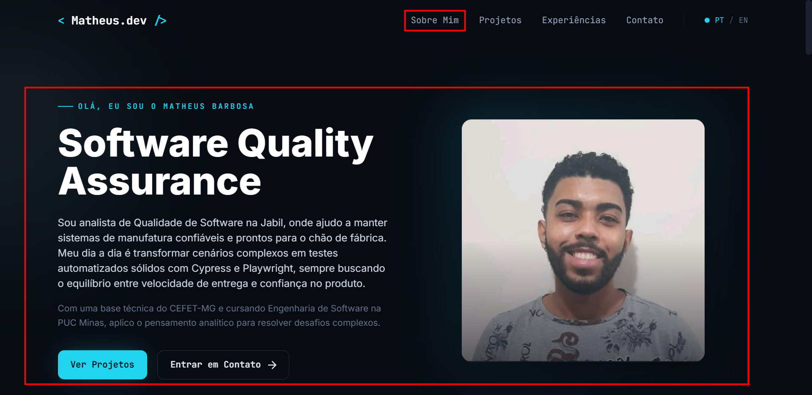
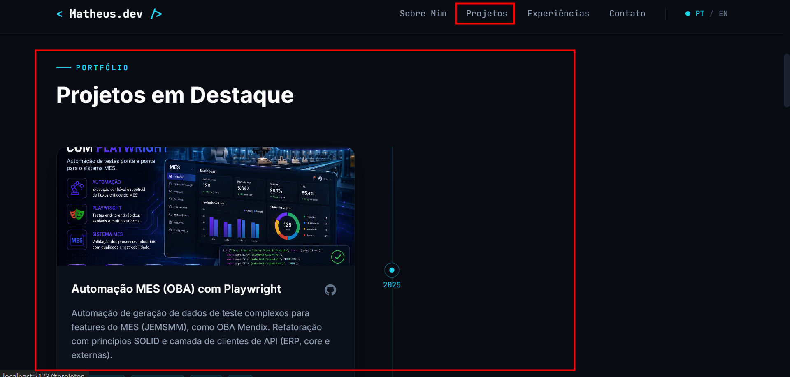
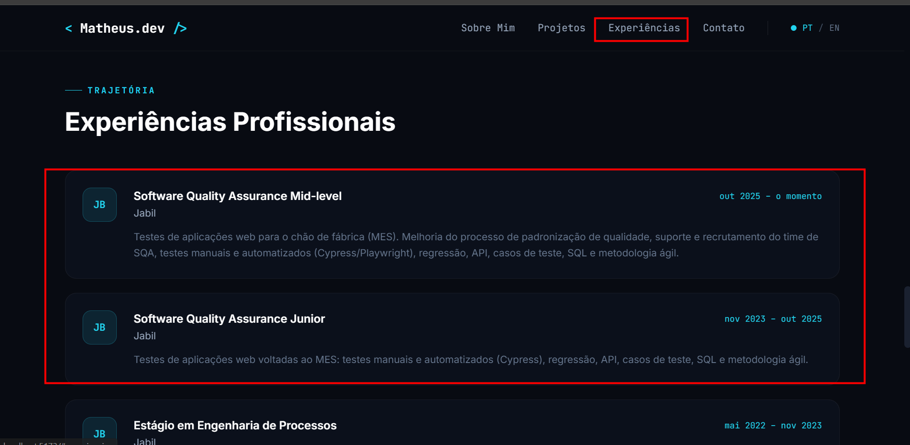

# Lab01S02 : Implementação das funcionalidades principais

## Objetivos da Sprint
Implementação das páginas principais do portfólio (Sobre Mim, Projetos, Experiências, Contato) e garantias de responsividade e validações.

## Tarefas e Evidências

- [x] Página "Sobre Mim" com versões em português e inglês
  
- [x] Página "Projetos" com timeline dinâmica
  
- [x] Página "Experiências" com dados organizados
  
- [x] Página "Contato" com ícones e formulário funcional (ex: envio de e-mail)
  
- [x] Validações básicas e responsividade
  - 📄 **Evidência:** [Testes de Responsividade](./evidencias/teste.mp4)

## Entrega
- Versão funcional local ou com preview em ambiente temporário (ex: Vercel Preview).
  - 📄 **Evidência da Entrega:** [Link do Preview](./evidencias/teste.mp4)
